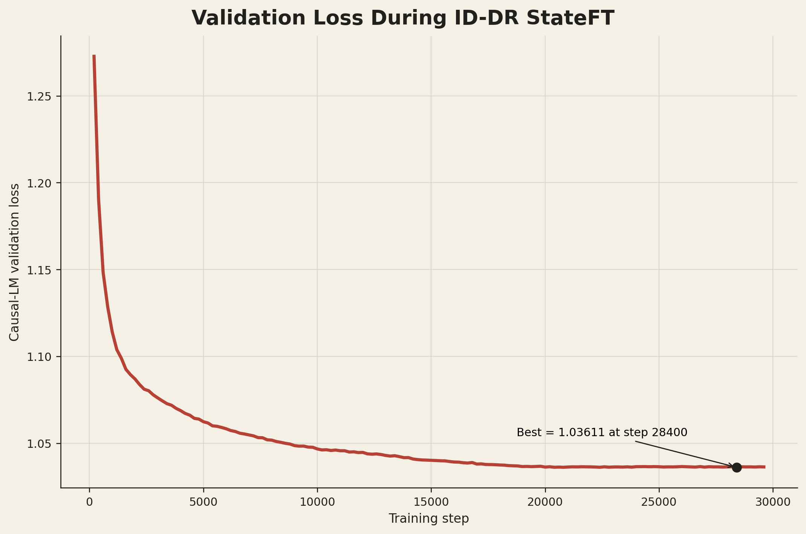
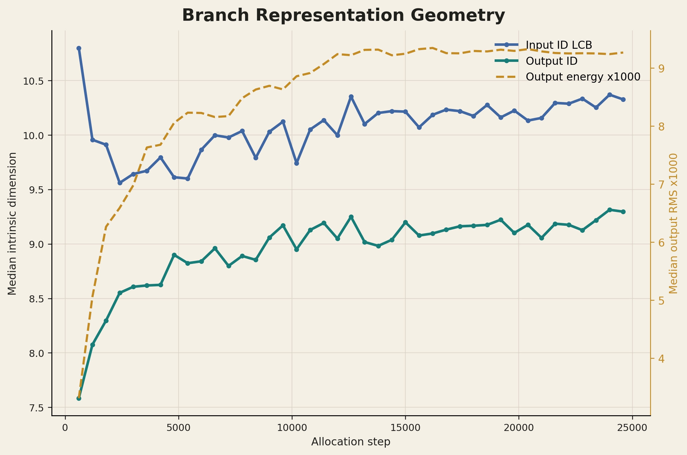
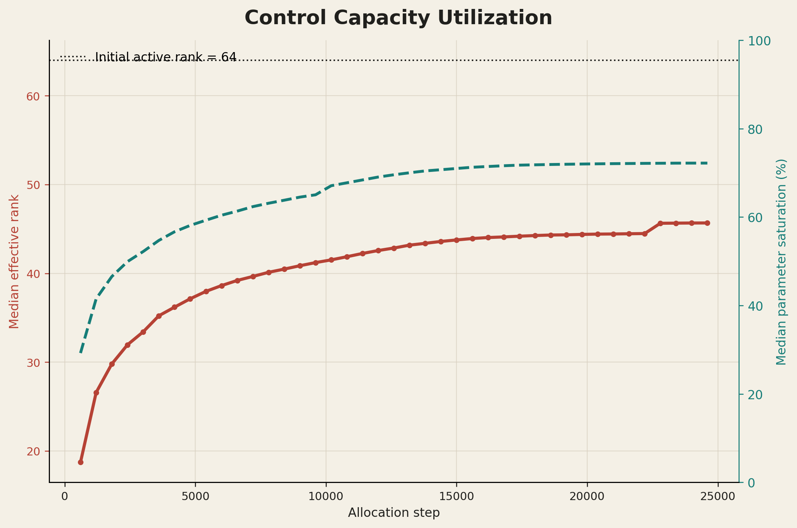
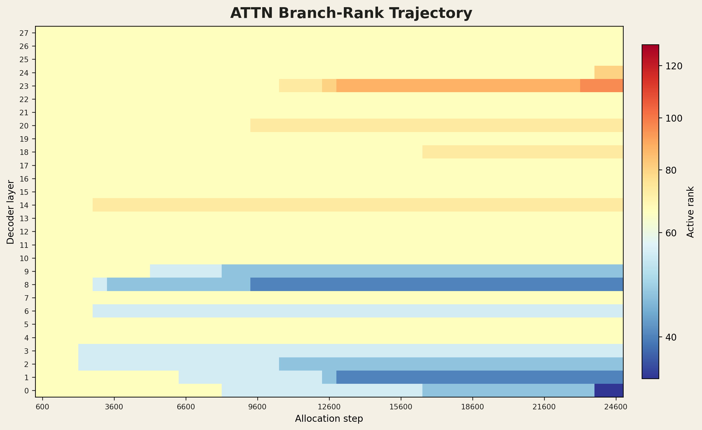
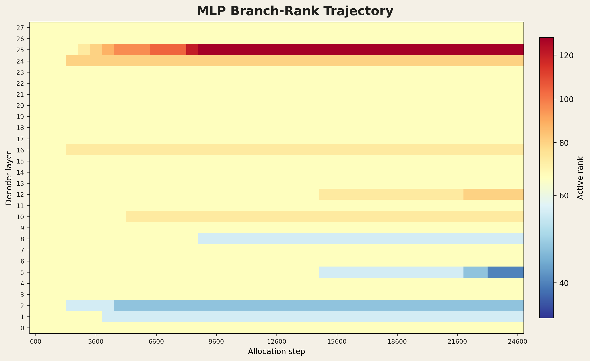
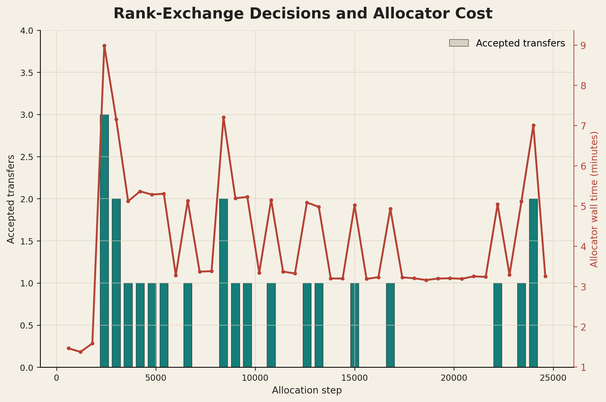

# Llama 3B ID-DR StateFT

This repository implements branch-specific dynamic-rank Double StateFT for
`meta-llama/Llama-3.2-3B`. The Llama backbone is frozen. Every decoder layer has
an independent attention residual control and MLP residual control; a fixed
global rank budget is redistributed using calibration-loss sensitivity and an
uncertainty-aware intrinsic-dimension prior.

完整架構、模組對照、輸出格式與執行方式見 [IMPLEMENTATION.md](IMPLEMENTATION.md)。

## Setup

```bash
cd /home/hank/StateFT/Llama-3B-Double-StateFT
conda activate llama
python -m pip install -r requirements.txt
export HF_TOKEN=your_huggingface_token
```

不要使用系統 `pip`；`python -m pip` 會安裝到目前啟用的 conda environment，
可避開 Debian PEP 668 `externally-managed-environment` 錯誤。

## Run

完整訓練、compact export、八項評估與分析：

```bash
./run_full_pipeline.sh
```

只訓練主方法：

```bash
python train_id_dr_3b.py \
  --allocation-method id_exchange \
  --output-dir checkpoints/llama-3.2-3b-id-dr-stateft
```

只評估既有 compact adapter：

```bash
python evaluate_3b.py \
  --output-dir checkpoints/llama-3.2-3b-id-dr-stateft
```

`datasets` 預設需包含 `commonsense_170k.json` 與八個 benchmark 的
`<dataset>/test.json`。Checkpoint 只保存 Control 權重，不複製 3B frozen base。

## Experiment Figures

The plotted metrics are generated with `plot_experiment.py`. Each raster figure
also has a vector PDF for papers and presentations.

### Validation Loss

[PDF](figures/id-dr-main/01_validation_loss.pdf)



### Branch Geometry

[PDF](figures/id-dr-main/02_branch_geometry.pdf)



### Capacity Utilization

[PDF](figures/id-dr-main/03_capacity_utilization.pdf)



### Attention Rank Trajectory

[PDF](figures/id-dr-main/04_attn_rank_heatmap.pdf)



### MLP Rank Trajectory

[PDF](figures/id-dr-main/05_mlp_rank_heatmap.pdf)



### Allocation Overhead

[PDF](figures/id-dr-main/06_allocation_overhead.pdf)



## Tests

```bash
conda run -n llama python -m unittest discover -v
```

## Scope

The implementation is 3B-only. Historical 7B/8B, LoRA, DoRA, and unrelated
experiment code are intentionally excluded.

## License

Apache-2.0. See [LICENSE](LICENSE).
